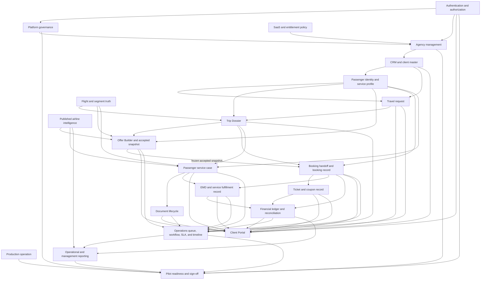

# AeroAssist V1 Operational Dependency Graph

## Purpose

This document maps the dependencies that must hold for AeroAssist to support a real agency operation. It is a product-operating graph, not a phase map. An arrow means the downstream domain cannot be considered operationally complete unless the upstream record, decision, or control is trustworthy.

## Canonical Operating Graph



## Operational Truth Chain

The minimum trustworthy chain for a V1 booking is:

```text
authenticated actor
-> isolated agency
-> canonical client and passenger
-> immutable request source
-> mapped Trip Dossier and segments
-> evidenced airline/service decision
-> priced offer with source and validity
-> frozen accepted offer snapshot
-> authorized booking instruction
-> externally obtained booking result
-> reconciled booking record
-> externally obtained ticket/EMD result
-> reconciled coupon/service/financial state
-> passenger-service and document fulfillment evidence
-> completed operational and financial checklist
-> archived audit record
```

Today, AeroAssist is strongest from request intake through accepted-offer metadata. The chain weakens at external booking, ticket/EMD fulfillment, financial reconciliation, and final completion. A manual external action is acceptable in V1 only if AeroAssist records its owner, input snapshot, authorization, result, failure state, reconciliation, and evidence.

## Domain Dependency Matrix

| Domain | Depends on | Enables | Failure effect |
|---|---|---|---|
| Authentication | Identity store, session policy, secrets, audit | Every protected action | Unauthorized access or inability to attribute actions |
| Platform | Authentication, production diagnostics, governance data | Agency lifecycle, knowledge governance, release control | System-wide misconfiguration or unreviewed release |
| Agency management | Platform, authentication, SaaS policy | Staff, clients, all tenant work | Tenant boundary or ownership failure |
| CRM | Agency, identity and privacy controls | Passengers, requests, portal, finance | Duplicate clients, wrong communication, privacy incident |
| Passengers | CRM, documents, consent and sensitive-data policy | Requests, offers, bookings, services | Wrong traveler identity or unmet assistance need |
| Requests | CRM, passengers, segment taxonomy | Trip creation, queue, SLA, offers | Incomplete or mistranslated customer need |
| Trips | Request conversion, passenger and segment mapping | Offer, booking, operations, completion | No coherent journey-level operational record |
| Flights | Segment identity, schedule source, reconciliation | Offers, service feasibility, operations | Stale timing/carrier data and missed service constraints |
| Airline Intelligence | Evidence, governance, QA, publication, freshness | Feasibility, recommendations, offers, service instructions | Unsafe certainty or incorrect airline advice |
| Offer Builder | Trip, flights, airline intelligence, pricing source | Acceptance and booking handoff | Commercial mismatch or non-bookable promise |
| Booking | Accepted snapshot, passenger/segment mapping, supplier procedure | Ticket, EMD, service fulfillment, finance | PNR divergence and unowned fulfillment work |
| Ticketing | Booking, fare/tax/coupon source, authorization | Travel proof, servicing, finance | Incorrect coupon state or untracked financial exposure |
| EMD | Booking, passenger service, RFIC/RFISC truth, authorization | Ancillary fulfillment and finance | Paid service not associated or delivered |
| Passenger Services | Passenger need, segment scope, airline rules, approval | Travel readiness, EMD, documents | Assistance accepted commercially but not operationally fulfilled |
| Documents | Passenger/service requirements, storage, verification, visibility | Approval, travel readiness, portal | Missing, expired, leaked, or unverified travel evidence |
| Financial tracking | Offer, booking, ticket, EMD, payment evidence | Settlement, refunds, management reporting | Unknown balance, margin, liability, or refund state |
| Client Portal | Authentication, object authorization, client-safe projections | Customer intake, acceptance, status, document exchange | Cross-client leakage or misleading status |
| Operations | All operational records, assignment, workflow, SLA | Daily work, exception handling, completion | Work silently ages or falls between modules |
| Reporting | Canonical records, definitions, reconciliation | Owner oversight and release evidence | Decisions based on inconsistent counts |
| SaaS | Platform, agency lifecycle, entitlement policy | Commercial operation of AgencyOS | Incoherent subscription behavior or manual revenue leakage |
| Production | Deployment, database, backups, observability, incident process | Reliable availability and recovery | Service outage or unrecoverable data loss |
| Pilot readiness | All required domains plus reviewed evidence | Controlled external use | Pilot starts with known critical blockers |

## Cross-Cutting Control Dependencies

### Agency Isolation

Agency isolation is a precondition, not a feature local to one router. It must hold across API filters, service lookups, mutations, exports, portal projections, synthetic datasets, diagnostics, and reporting. A route-level dependency does not compensate for a service that can resolve another agency's object by ID.

### Internal and Client-Facing Separation

Internal notes, evidence, supplier instructions, confidence assessments, restricted attachments, queue context, and operational warnings must be projected explicitly into client-safe responses. Reusing an internal model as a portal response creates a direct privacy dependency from every backend field to the Client Portal.

### Immutable Source Snapshots

The following should remain immutable audit anchors:

- original request/intake snapshots;
- imported raw supplier or GDS text;
- frozen accepted offer snapshots;
- booking/ticket/EMD import evidence;
- approved airline-knowledge releases;
- release assessments and human sign-offs.

Mutable workspaces should refer to these anchors rather than rewrite them.

### Time and Exception Handling

Queue, workflow, SLA, document validity, offer validity, ticketing deadlines, departure proximity, and service notice periods depend on durable time evaluation. Process-local counters and request-triggered recalculation are not sufficient for unattended deadline monitoring. Until durable scheduling exists, V1 needs a documented operator-owned sweep and reconciliation procedure.

## Canonical Ownership Decisions Required

| Business object | Candidate implementations observed | V1 ownership decision required |
|---|---|---|
| Client | client profile, client master, CRM projections | Name one canonical client ID and define compatibility projections |
| Passenger | passenger profile, master record, workspace, request/trip passenger | Define identity master versus journey-specific snapshot |
| Trip | trip dossier, trip workspace, journey composition | Make Trip Dossier the aggregate and define workspace compatibility |
| Offer | offer, offer workspace, offer workspace v2, journey offer composition | Make one Offer Workspace authoritative and preserve accepted snapshots |
| Booking | booking workspace, booking record, readiness package, handoff | Separate instruction, external result, and canonical booking state |
| Ticket | ticket workspace, ticket record, coupon, exchange/servicing records | Define ticket document and coupon authority plus immutable source evidence |
| EMD | EMD workspace, EMD record, service association, refund/exchange records | Define document, coupon/service association, and financial authority |
| Document | document workspace, storage, render, package, share, delivery | Define one lifecycle and treat other modules as capabilities |
| Task/work | generic task, request task, operational work item, workflow task | Use one daily work queue with explicit compatibility mappings |
| Timeline | domain timelines and operational timeline | Define operational timeline as projection or canonical event ledger |

## Release-Critical Dependency Paths

### Path A: Safe Customer Commitment

```text
Passenger need -> segment scope -> published evidence -> feasibility
-> offer caveat -> accepted snapshot -> booking instruction
```

Blocked when evidence is stale, service scope is ambiguous, price/availability has no source, or the accepted snapshot cannot be traced to the booking instruction.

### Path B: Fulfillment and Travel Readiness

```text
Booking result -> ticket/EMD result -> coupon/service association
-> document and approval evidence -> departure readiness -> completion
```

Blocked by absent external-result reconciliation, unclear ticket/EMD status authority, and no single travel-readiness completion gate.

### Path C: Money and Servicing

```text
Accepted price -> invoice/payment evidence -> supplier cost
-> ticket/EMD values -> change/refund calculation -> settlement
```

Blocked by the absence of a canonical ledger and reconcilable refund/change/fee records.

### Path D: Production Approval

```text
running commit/phase -> health/readiness -> smoke inventory
-> authenticated backup -> checksum/manifest -> restore rehearsal
-> tenant-isolation evidence -> rollback reference
-> reviewed assessment -> authorized sign-off
```

Blocked until persisted production evidence is reviewed. A healthy endpoint alone is not release evidence.

## Known Broken or Weak Edges

1. The airline contact integration map refers to `ssr_osi_operational_workspaces`, while the implemented collection is `ssr_osi_workspaces`; this can silently weaken cross-module linkage.
2. Flight records have no authoritative live or operator-governed refresh/reconciliation loop, so downstream offers and service deadlines can use stale segment facts.
3. Booking, ticket, and EMD workspaces can store external facts but do not yet prove instruction-to-result-to-reconciliation closure.
4. Financial records do not form a canonical double-entry or equivalent operational ledger across customer receipts, supplier costs, tickets, EMDs, fees, refunds, and commissions.
5. Queue/SLA/workflow automation is broad, but unattended time progression and production monitoring remain operationally manual.
6. Reporting cannot be trusted beyond module summaries until canonical record ownership and reconciliation rules are settled.
7. Pilot readiness remains dependent on reviewed production, backup, restore, isolation, rollback, and human sign-off evidence.

## V1 Dependency Rule

A downstream module may display an upstream state, but it must not silently promote that state from unknown to confirmed. Unknown, stale, conflicting, manual-only, externally pending, and unverified are valid operational states. V1 readiness requires those states to create visible work, an owner, a deadline, and a documented resolution path.
